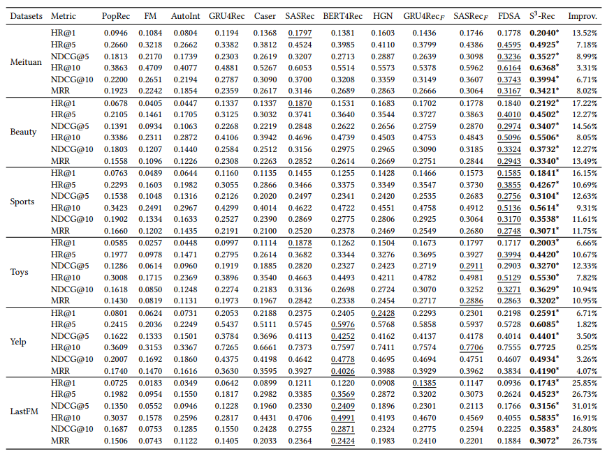
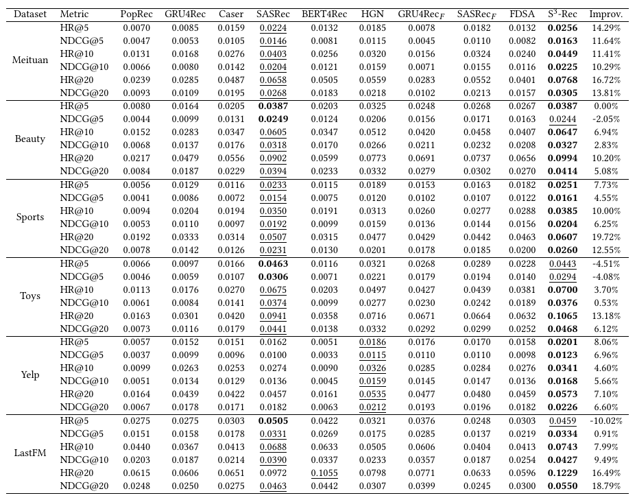

Code for our CIKM 2020 Paper ["**S3-Rec: Self-Supervised Learning for Sequential
 Recommendation with Mutual Information Maximization"**](https://arxiv.org/pdf/2008.07873.pdf)

## Overview
The major contributions of our paper are four self-supervised optimization objectives, which capture item-attribute, sequence-item, sequence-attribute and sequence-subsequence correlations in raw data, respectively. And these optimization objectives are developed in a unified form of mutual information maximization.


## Reproduce
Since we conduct extensive experiment on ***six datasets*** and under ***two evaluation scene*** (ranking with 99 negative items or all items), you can check the ***./reproduce/ directory*** to try your targeted dataset or evaluation scene as you like.

## Results
We illustrate the performance of our method comparing with different methods on six datasets. The best performance and the second best performance methods are denoted in bold and underlined fonts respectively.

Considering some of recent researchers argue the effectiveness of different ranking strategy for testing recommender system, we conduct experiment for two mainstream evaluation approaches. 
[**It is really time-consuming for the additional experiment, please do not save your star :)**](https://github.com/RUCAIBox/CIKM2020-S3Rec/)

In the PAPER, we pair the ground-truth item with **99 randomly sampled negative items** that the user has not interacted with, and report the results of HR@{1, 5, 10}, NDCG@{5, 10} and MRR. The used test files are name as 
```
data-name_sample.txt
```
The results are shown in the following picture.



We alse rank the ground-truth item with **all items**. We omit the FM and AutoInt because they need enumerate all user-item pairs, which take a very long time.
The results are shown in the following picture.




### requirements
```shell script
pip install -r requirements.txt
```

## data format
```shell script
data preprocess
./data/data_process.py

generate negative items for testing
./data/generate_test.py


data-name.txt
one user per line
user_1 item_1 item_2 ...
user_2 item_1 item_2 ...

data-name_sample.txt
one user per line
user_1 neg_item_1 neg_item_2 ...
user_2 neg_item_1 neg_item_2 ...

data-name_item2attributes.json
{item_1:[attr, ...], item_2:[attr, ...], ... }
```

## pretrain
```shell script
python run_pretrain.py \
--data_name data_name
```

## finetune
We support two evaluation methods. For more details, please check the ./reproduce directory.

+ Rank ground-truth item with 99 randomly sampled negative items
```shell script
python run_finetune_sample.py \
--data_name data_name \
--ckp pretrain_epochs_num
```

+ Rank the ground-truth item with all the items
```shell script
python run_finetune_full.py \
--data_name data_name \
--ckp pretrain_epochs_num
```


### Cite
If you find the our codes and datasets useful for your research or development, please cite our paper:

```
@inproceedings{CIKM2020-S3Rec,
  author    = {Kun Zhou and
               Hui Wang and
               Wayne Xin Zhao and
               Yutao Zhu and
               Sirui Wang and
               Fuzheng Zhang and
               Zhongyuan Wang and
               Ji{-}Rong Wen},
  title     = {S3-Rec: Self-Supervised Learning for Sequential Recommendation with
               Mutual Information Maximization},
  booktitle = {{CIKM} '20: The 29th {ACM} International Conference on Information
               and Knowledge Management, Virtual Event, Ireland, October 19-23, 2020},
  pages     = {1893--1902},
  publisher = {{ACM}},
  year      = {2020}
}
```

### Contact
If you have any question for our paper or codes, please send email to hui.wang@ruc.edu.cn.
